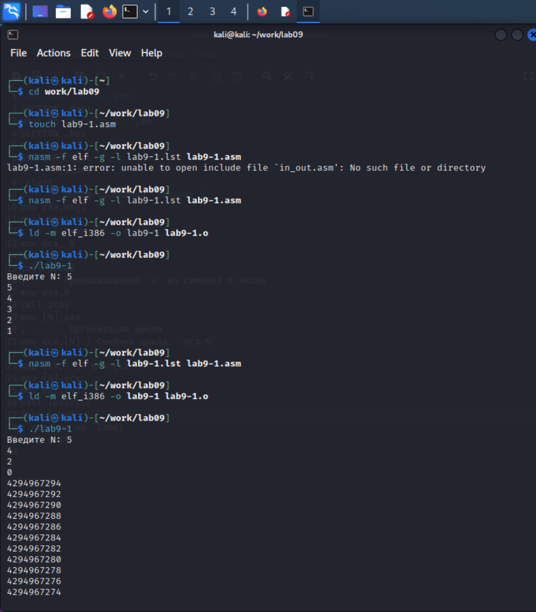
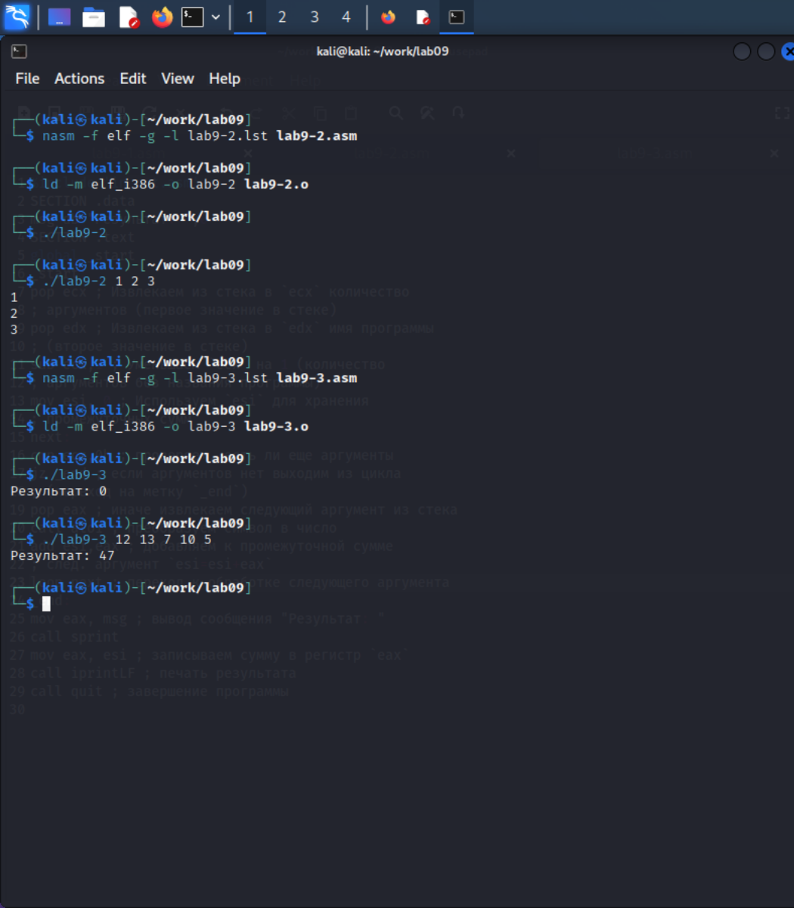
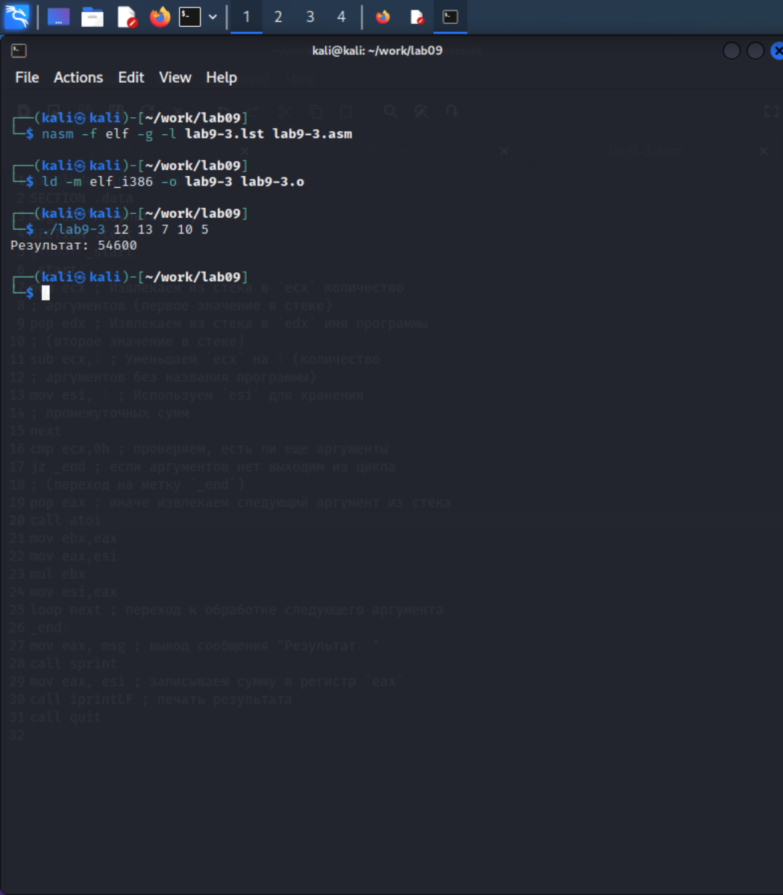
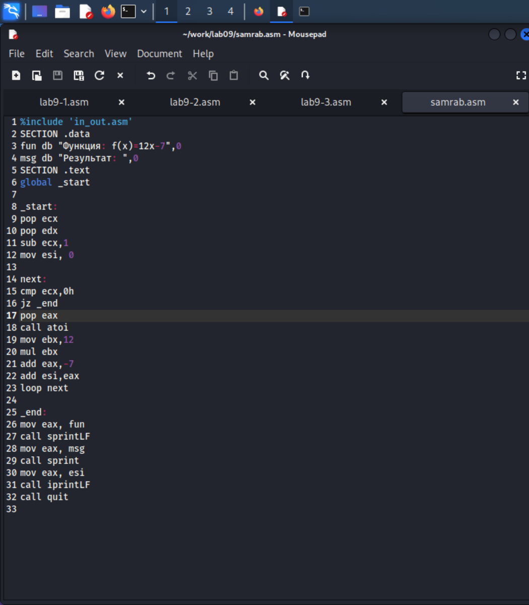
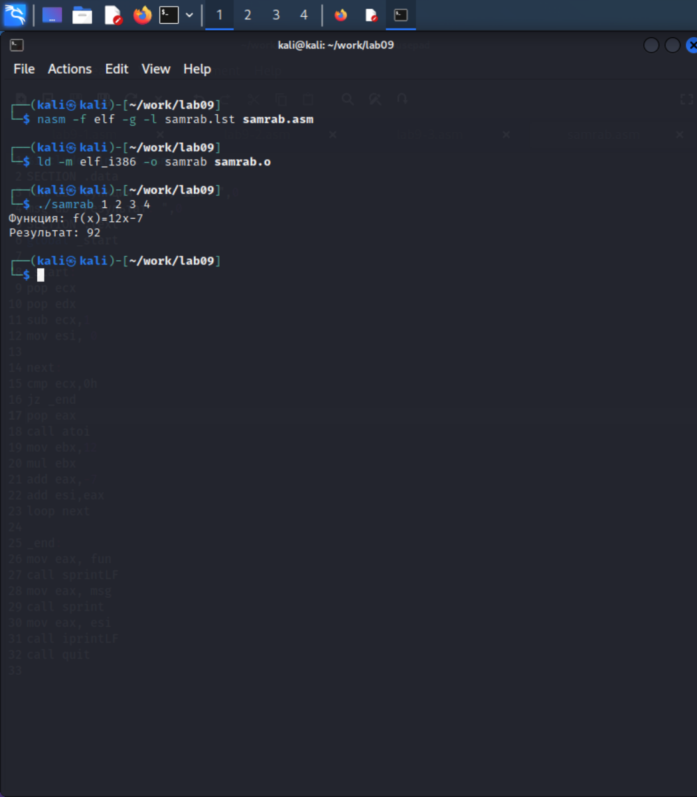

---
## Front matter
title: "Отчёт по лабораторной работе 9"
subtitle: "Программирование цикла. Обработка аргументов командной строки."
author: "Чесноков Артемий Павлович"

## Generic otions
lang: ru-RU
toc-title: "Содержание"

## Bibliography
bibliography: bib/cite.bib
csl: pandoc/csl/gost-r-7-0-5-2008-numeric.csl

## Pdf output format
toc: true # Table of contents
toc-depth: 2
lof: true # List of figures
lot: true # List of tables
fontsize: 12pt
linestretch: 1.5
papersize: a4
documentclass: scrreprt
## I18n polyglossia
polyglossia-lang:
  name: russian
  options:
	- spelling=modern
	- babelshorthands=true
polyglossia-otherlangs:
  name: english
## I18n babel
babel-lang: russian
babel-otherlangs: english
## Fonts
mainfont: PT Serif
romanfont: PT Serif
sansfont: PT Sans
monofont: PT Mono
mainfontoptions: Ligatures=TeX
romanfontoptions: Ligatures=TeX
sansfontoptions: Ligatures=TeX,Scale=MatchLowercase
monofontoptions: Scale=MatchLowercase,Scale=0.9
## Biblatex
biblatex: true
biblio-style: "gost-numeric"
biblatexoptions:
  - parentracker=true
  - backend=biber
  - hyperref=auto
  - language=auto
  - autolang=other*
  - citestyle=gost-numeric
## Pandoc-crossref LaTeX customization
figureTitle: "Рис."
tableTitle: "Таблица"
listingTitle: "Листинг"
lofTitle: "Список иллюстраций"
lotTitle: "Список таблиц"
lolTitle: "Листинги"
## Misc options
indent: true
header-includes:
  - \usepackage{indentfirst}
  - \usepackage{float} # keep figures where there are in the text
  - \floatplacement{figure}{H} # keep figures where there are in the text
---

# Цель работы

Приобретение навыков написания программ с использованием циклов и
обработкой аргументов командной строки.

# Выполнение лабораторной работы

1. Создадим каталог для лабораторной работы и файл lab9-1.asm (рис. [-@fig:001])

{ #fig:001 width=70%, height=70% }

2. Запишем в него код из листинга 9.1(рис. [-@fig:002])

{ #fig:002 width=70%, height=70% }

3. Создадим исполняемый файл и проверим его работу(рис. [-@fig:003])

{ #fig:003 width=70%, height=70% }

4. Изменим текст программы по инструкции в лабораторной(рис. [-@fig:004])

{ #fig:004 width=70%, height=70% }

5. Скомпилируем снова это файл. То как меняется ecx мы можем посмотреть по выводу программы, каждое выведенное число - это ecx. Из-за изменения регистра ecx число подходов цикла не сответсвует числу введеному в программу(рис. [-@fig:005])

{ #fig:005 width=70%, height=70% }

6. Снова изменим программу, добавив push и pop.(рис. [-@fig:006])

{ #fig:006 width=70%, height=70% }

7. Скомпилируем и проверим. Проход циклов соответсвует введёному с клавитуры(рис. [-@fig:007])

{ #fig:007 width=70%, height=70% }

8. Создадим файл lab9-2.asm и введём код из листинга9.2 (рис. [-@fig:008])

{ #fig:008 width=70%, height=70% }

9. Проверим работиу программы. Все аргументы были обработаны программой. (рис. [-@fig:009])

{ #fig:009 width=70%, height=70% }

10. Создадим файл lab9-3.asm и введём код из листинга 9.3 (рис. [-@fig:010])

{ #fig:010 width=70%, height=70% }

11. Скомпилируем и проверим (рис. [-@fig:011])

{ #fig:011 width=70%, height=70% }

12. Изменим код программы, для вычисления произведения аргументов (рис. [-@fig:012])

{ #fig:012 width=70%, height=70% }

13. Проверим работу программы. Ответ при тех же аргументах должен быть 54600. И мы убедились, что всё работат хорошо. (рис. [-@fig:013])

{ #fig:013 width=70%, height=70% }

# Выполнение самостоятельной работы

1. Прочитаем задание самостоятельной работы и напишем программу по моему 13 варианту.(рис. [-@fig:014])

{ #fig:014 width=70%, height=70% }

2. Проверим его работу. Ответ верны, проверил калькулятором. (рис. [-@fig:015])

{ #fig:015 width=70%, height=70% }

# Выводы

В данной лабораторной работе я приобрел навыки написания программ на языке NASM с использованием циклов и обработкой командной строкой.
https://github.com/Sinabon2004/study_2022-2023_arh-pc
