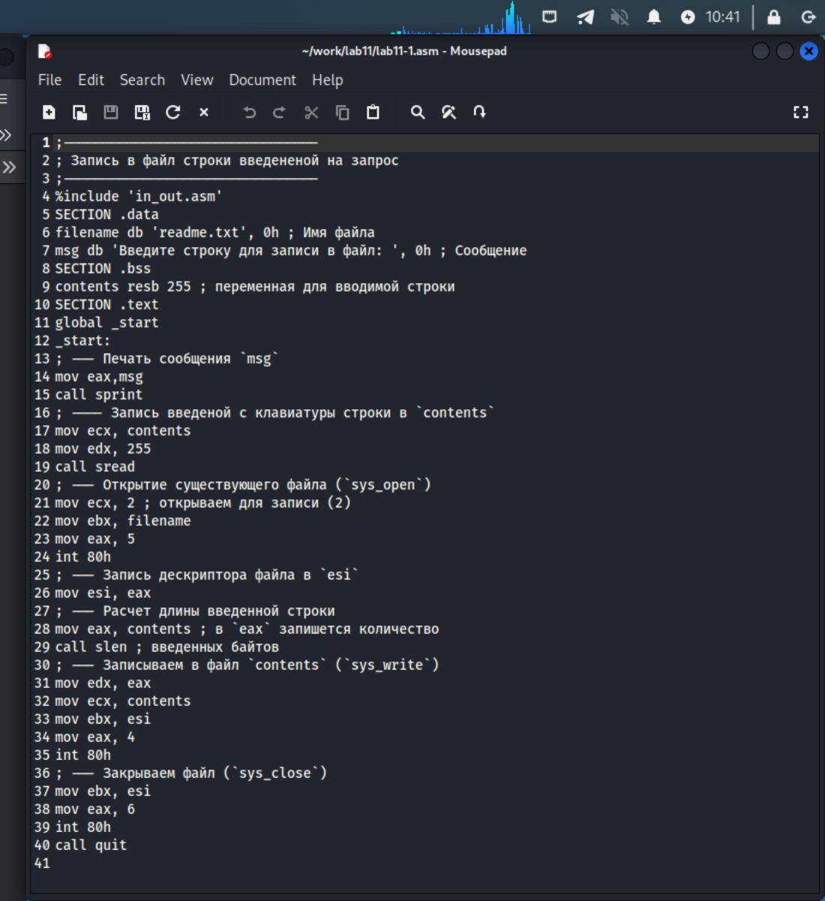
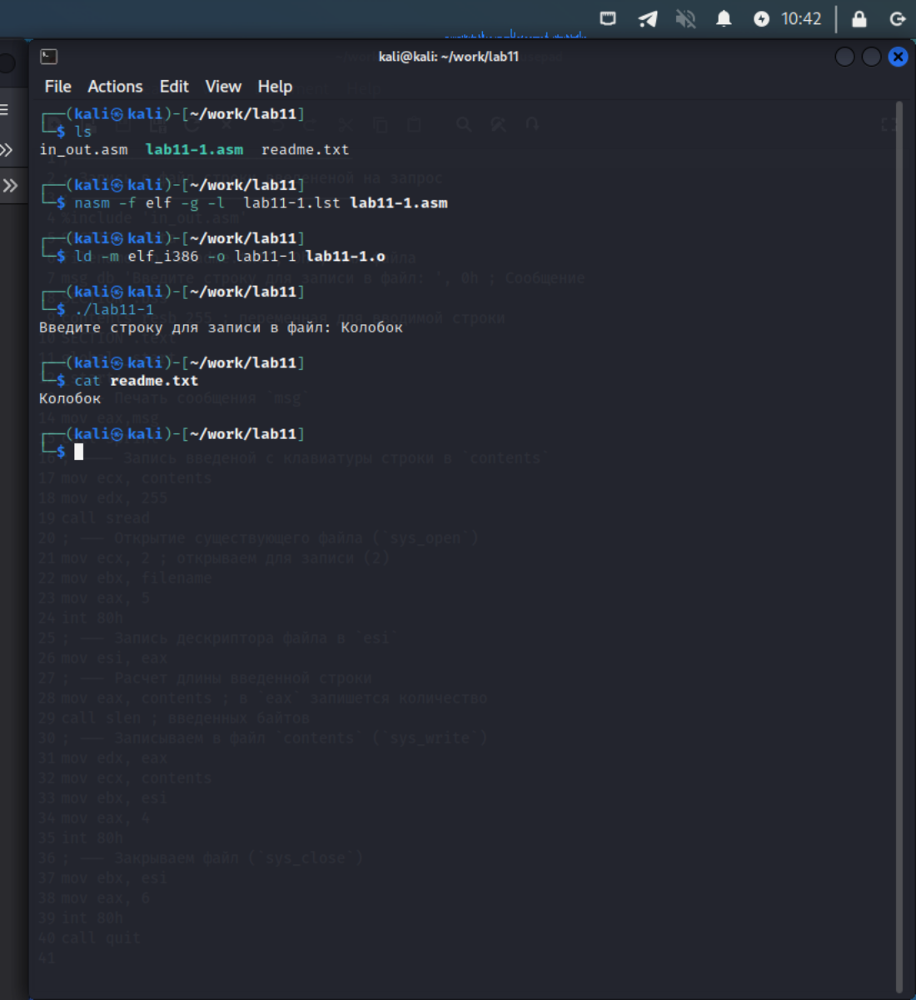
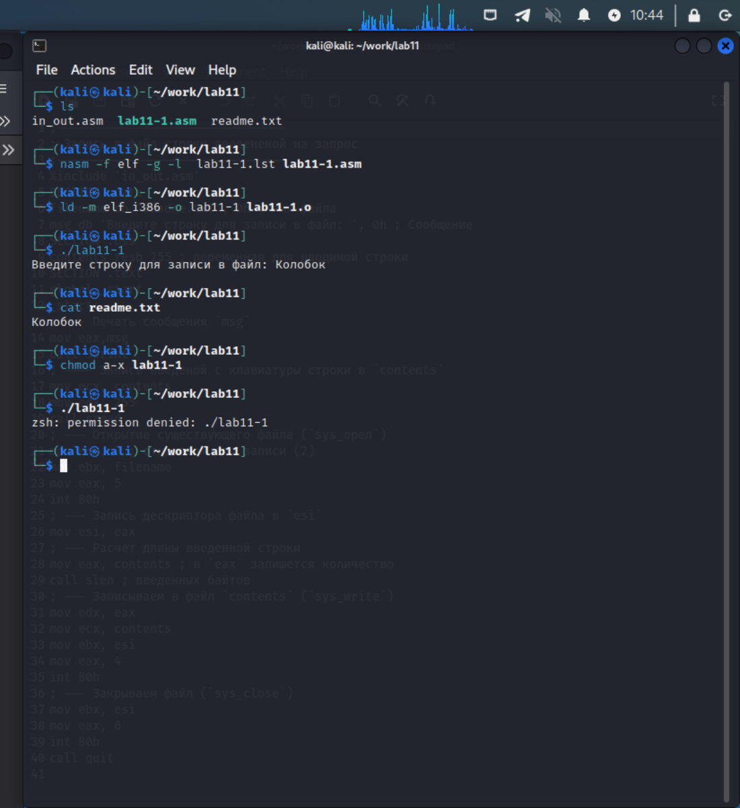
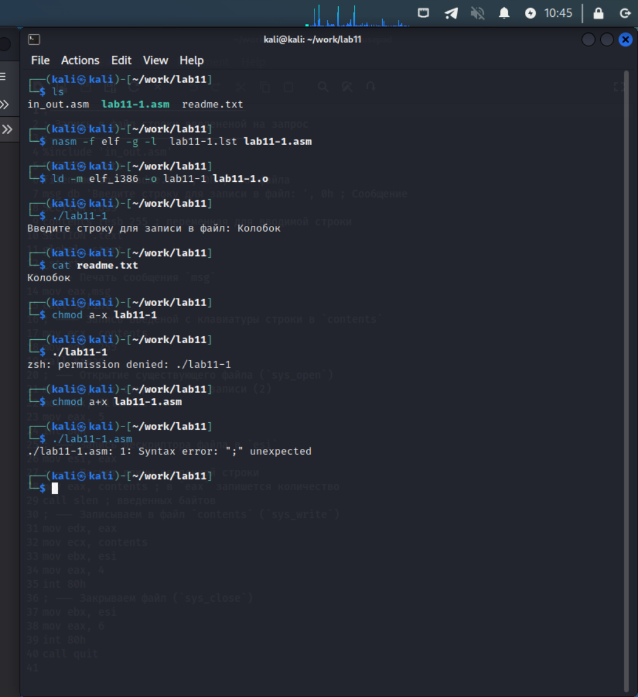
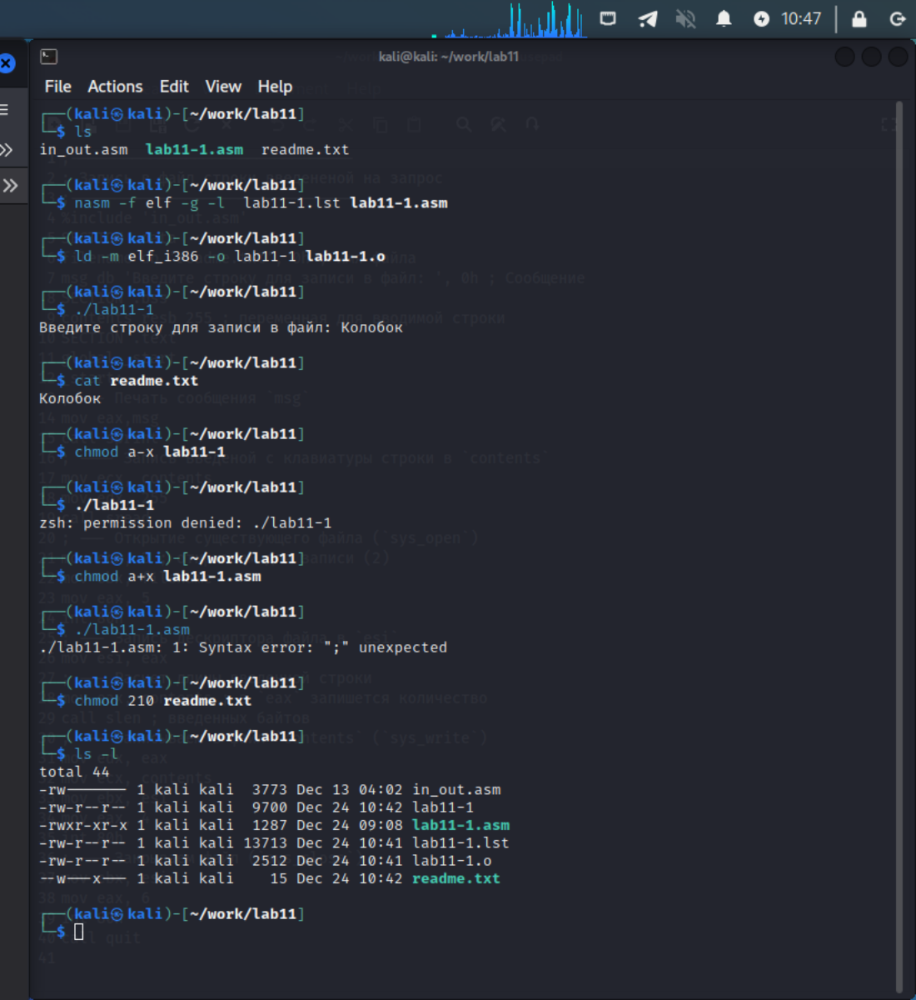
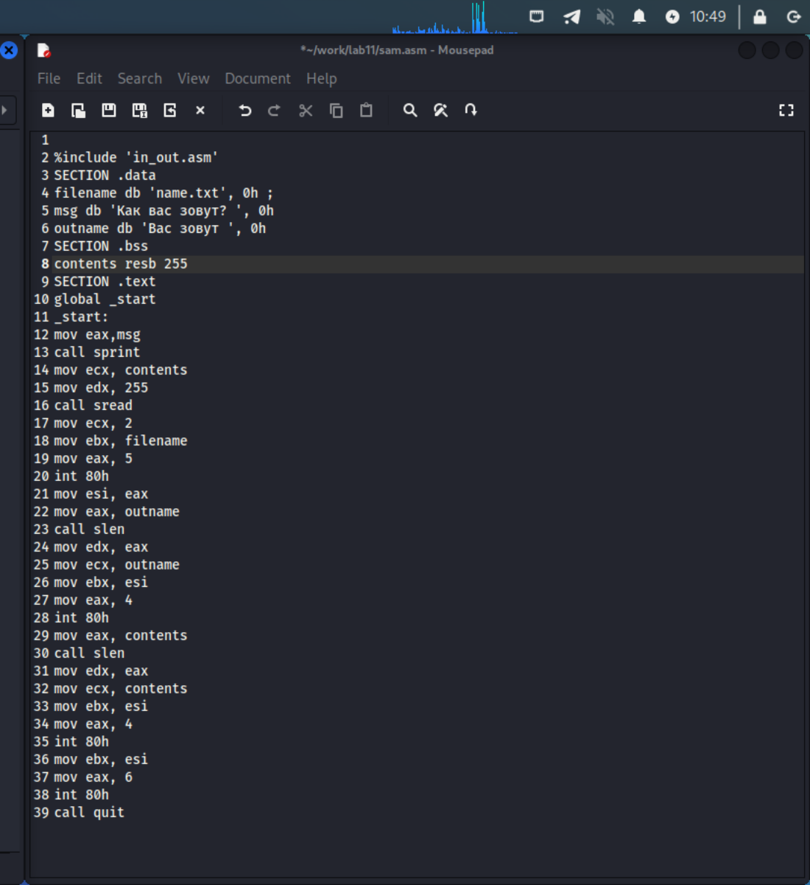
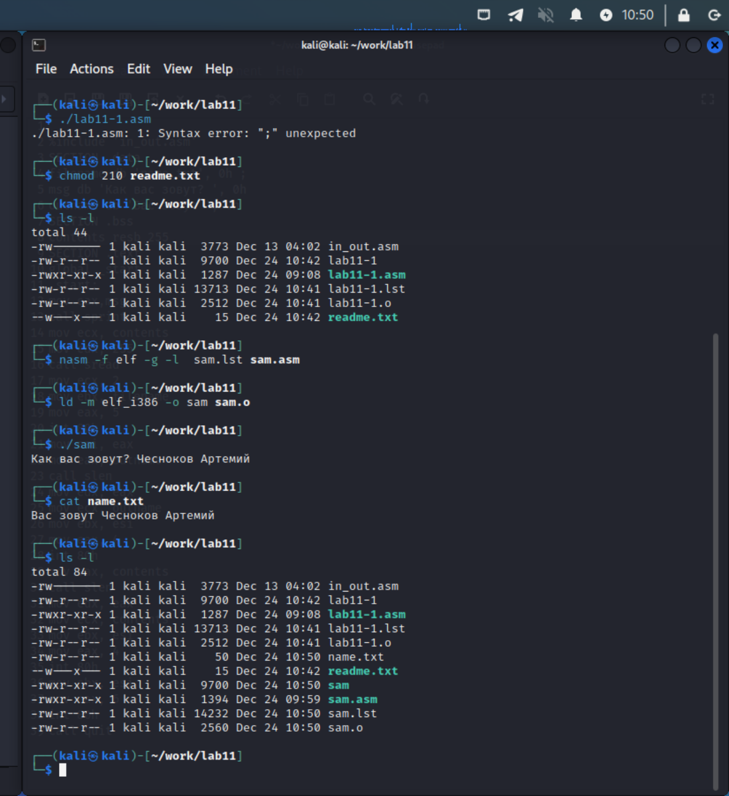

---
## Front matter
title: "абораторная работа No11"
subtitle: "Работа с файлами средствами Nasm"
author: "Чесноков Артемий Павлович"

## Generic otions
lang: ru-RU
toc-title: "Содержание"

## Bibliography
bibliography: bib/cite.bib
csl: pandoc/csl/gost-r-7-0-5-2008-numeric.csl

## Pdf output format
toc: true # Table of contents
toc-depth: 2
lof: true # List of figures
lot: true # List of tables
fontsize: 12pt
linestretch: 1.5
papersize: a4
documentclass: scrreprt
## I18n polyglossia
polyglossia-lang:
  name: russian
  options:
	- spelling=modern
	- babelshorthands=true
polyglossia-otherlangs:
  name: english
## I18n babel
babel-lang: russian
babel-otherlangs: english
## Fonts
mainfont: PT Serif
romanfont: PT Serif
sansfont: PT Sans
monofont: PT Mono
mainfontoptions: Ligatures=TeX
romanfontoptions: Ligatures=TeX
sansfontoptions: Ligatures=TeX,Scale=MatchLowercase
monofontoptions: Scale=MatchLowercase,Scale=0.9
## Biblatex
biblatex: true
biblio-style: "gost-numeric"
biblatexoptions:
  - parentracker=true
  - backend=biber
  - hyperref=auto
  - language=auto
  - autolang=other*
  - citestyle=gost-numeric
## Pandoc-crossref LaTeX customization
figureTitle: "Рис."
tableTitle: "Таблица"
listingTitle: "Листинг"
lofTitle: "Список иллюстраций"
lotTitle: "Список таблиц"
lolTitle: "Листинги"
## Misc options
indent: true
header-includes:
  - \usepackage{indentfirst}
  - \usepackage{float} # keep figures where there are in the text
  - \floatplacement{figure}{H} # keep figures where there are in the text
---

# Цель работы

Приобретение навыков написания программ для работы с файлами.

# Выполнение лабораторной работы

1. Создадим файлы readme.txt  и lab11-1.asm. В asm файл введем программу из лиснинга 11.1 (рис. [-@fig:001])

{ #fig:001 width=70% }

2. Запустим и проверим работу (рис. [-@fig:002])

{ #fig:002 width=70% }

3. Запретим файлу lab11-1 выполение и попробуем запустить. Из-за запрета на выполенение выходит сообщение, что у пользователя нет доступа для исполения файла (рис. [-@fig:003])

{ #fig:003 width=70% }

4. Разрешим исполнять файл lab11-1.asm и попробуем запустить. У нас выходит ошибка с таким посылом, что ошибка синтаксиса программы. Это происходит, т.к. файл asm не является исполняемым (рис. [-@fig:004])

{ #fig:004 width=70% }

5. Мой вариант 13. По таблице 11.4 я должен присвоить файлу readme.txt права -w- --x --- . Сделаем это (рис. [-@fig:005])

{ #fig:005 width=70% }

# Самостоятельная работа

1. Создадим файлы name.txt и sam.asm для выполения самостоятельной работы. Напишем программу для выполения задач в sam.asm.(рис. [-@fig:006])

{ #fig:006 width=70% }

2. Проверим работу по инструкции из самостоятельной(рис. [-@fig:007])

{ #fig:007 width=70% }

# Выводы

На данной лабораторной работы я научился писать программы NASM для работы с файлами.

https://github.com/Sinabon2004/study_2022-2023_arh-pc
